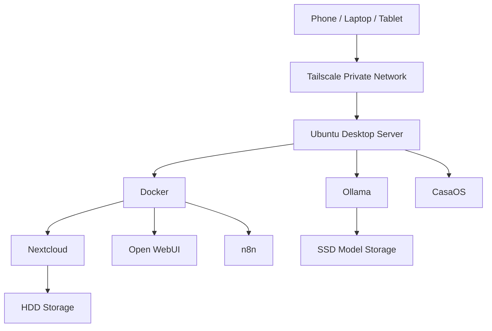

# lazycoffee 

Personal self-hosted homelab server for AI, cloud storage, automation, and secure private access.

---

## Overview

**lazycoffee** is a private home server project built around Ubuntu Desktop, Docker, Nextcloud, Ollama, Open WebUI, n8n, CasaOS, and Tailscale.

The main idea is to use one always-on PC as a personal cloud, local AI server, and automation machine while keeping personal services private.

---

## Current Plan

The current setup is **Tailscale-only**.

Personal services will stay private and will be accessed only from approved devices like phone, tablet, and laptop.

Cloudflare Tunnel and public domain access are kept as optional future expansion items only.

---

## Main Services

| Service | Purpose |
|---|---|
| Ubuntu Desktop 24.04 LTS | Base operating system |
| Docker | Container platform |
| CasaOS | Homelab dashboard |
| Nextcloud | Personal cloud storage |
| Ollama | Local AI model runner |
| Open WebUI | AI chat interface |
| n8n | Automation and workflows |
| Tailscale | Private remote access |
| PostgreSQL | Database |
| Redis | Cache |
| Immich | Future photo backup and gallery |

---

## Storage Plan

```text
SSD
├── Ubuntu
├── Docker
└── Ollama models

HDD
└── Nextcloud data
```

Planned paths:

```text
/srv/docker
/srv/ollama
/mnt/storage
/mnt/storage/nextcloud
```

---

## Documentation

| Document | Description |
|---|---|
| [Architecture](docs/architecture.md) | Main lazycoffee system architecture |
| [Diagrams](docs/diagrams.md) | Mermaid system and storage diagrams |
| [UML](docs/uml.md) | Deployment and service relationship diagrams |
| [Data Flows](docs/data-flows.md) | Nextcloud, AI chat, and automation data flows |
| [Setup Flow](docs/setup-flow.md) | Recommended installation sequence |
| [Storage Layout](docs/storage-layout.md) | SSD and HDD mount path plan |
| [Network Plan](docs/network-plan.md) | Tailscale-only private access plan |
| [Services](docs/services.md) | Planned services list |
| [Future](docs/future.md) | Future expansion notes |

---

## Architecture Preview



---

## Repo Structure

```text
lazycoffee/
├── docs/       Project documentation, diagrams, UML, and flows
├── docker/     Docker Compose templates
├── scripts/    Setup and backup scripts
└── notes/      Commands and troubleshooting notes
```

---

## Project Status

Initial documentation, architecture planning, Docker templates, and setup scripts are being prepared.

---


[](https://github.com/lucasmark07/GitWidgets)
