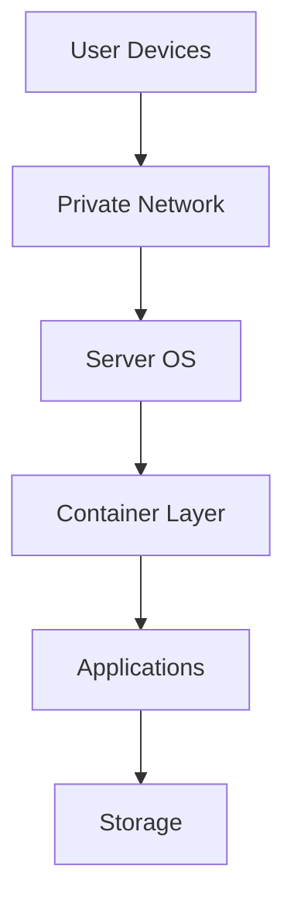
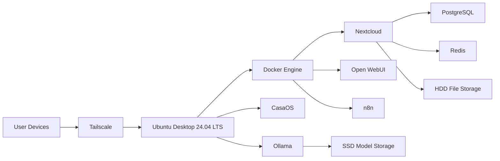

# Architecture

lazycoffee is a private homelab server project.

It combines cloud storage, local AI, automation, and private remote access on one always-on Ubuntu PC.

## Main Layers

## Component View

## Design Choice

The default design is private-first.

Tailscale is used for trusted device access. Cloudflare Tunnel and public domain access are reserved for future needs.
