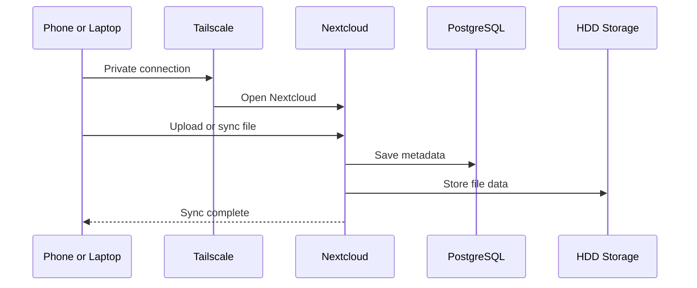
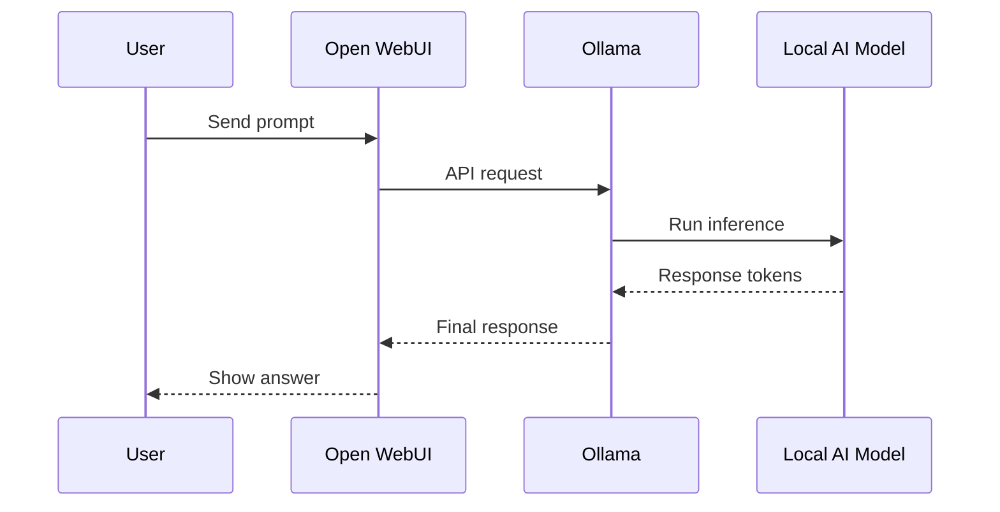
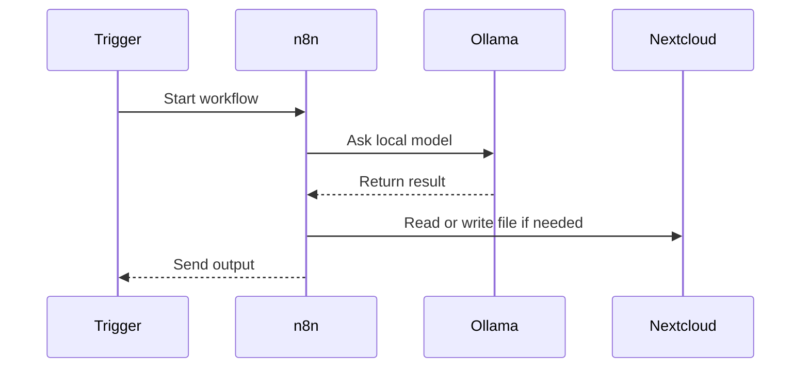

# Data Flows

This document explains how data moves inside lazycoffee.

## File Sync Flow

```mermaid
sequenceDiagram
    participant Device as Phone or Laptop
    participant TS as Tailscale
    participant NC as Nextcloud
    participant DB as PostgreSQL
    participant FS as HDD Storage

    Device->>TS: Private connection
    TS->>NC: Open Nextcloud
    Device->>NC: Upload or sync file
    NC->>DB: Save metadata
    NC->>FS: Store file data
    NC-->>Device: Sync complete
```

## Local AI Chat Flow

```mermaid
sequenceDiagram
    participant User
    participant UI as Open WebUI
    participant OL as Ollama
    participant Model as Local AI Model

    User->>UI: Send prompt
    UI->>OL: API request
    OL->>Model: Run inference
    Model-->>OL: Response tokens
    OL-->>UI: Final response
    UI-->>User: Show answer
```

## Automation Flow

```mermaid
sequenceDiagram
    participant Trigger
    participant N8N as n8n
    participant AI as Ollama
    participant Cloud as Nextcloud

    Trigger->>N8N: Start workflow
    N8N->>AI: Ask local model
    AI-->>N8N: Return result
    N8N->>Cloud: Read or write file if needed
    N8N-->>Trigger: Send output
```
