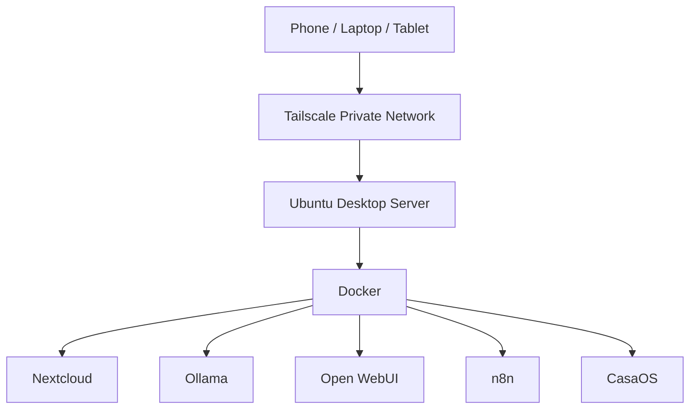

# Diagrams

This file contains Mermaid diagrams for the lazycoffee homelab.

## System Overview



## Storage Overview

```mermaid
flowchart TD
    SSD[SSD Storage] --> OS[Ubuntu]
    SSD --> DOCKER[/srv/docker]
    SSD --> AI[/srv/ollama]
    HDD[HDD Storage] --> NC[/mnt/storage/nextcloud]
```
