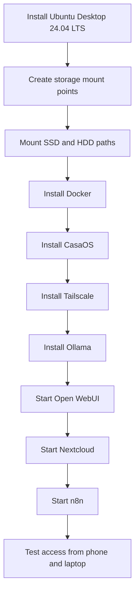

# Setup Flow

This document shows the recommended setup order for lazycoffee.

## Installation Phases

## Recommended Order

1. Install Ubuntu Desktop.
2. Confirm disks and partitions.
3. Create `/srv/docker`, `/srv/ollama`, and `/mnt/storage/nextcloud`.
4. Install Docker.
5. Install CasaOS.
6. Install Tailscale and connect devices.
7. Install Ollama.
8. Run Open WebUI.
9. Run Nextcloud.
10. Run n8n.
11. Test everything privately through Tailscale.

## Validation Checklist

- Docker service is running.
- Tailscale shows the server online.
- Nextcloud opens from trusted devices.
- Open WebUI can reach Ollama.
- n8n dashboard opens privately.
- HDD storage is mounted correctly.
