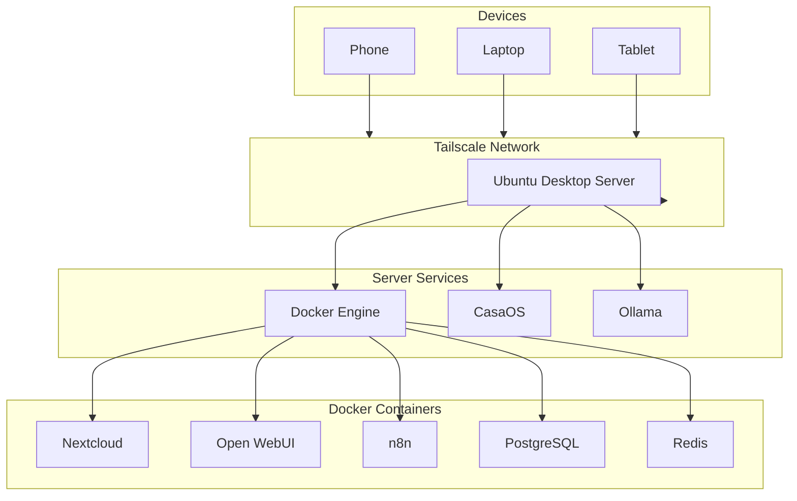
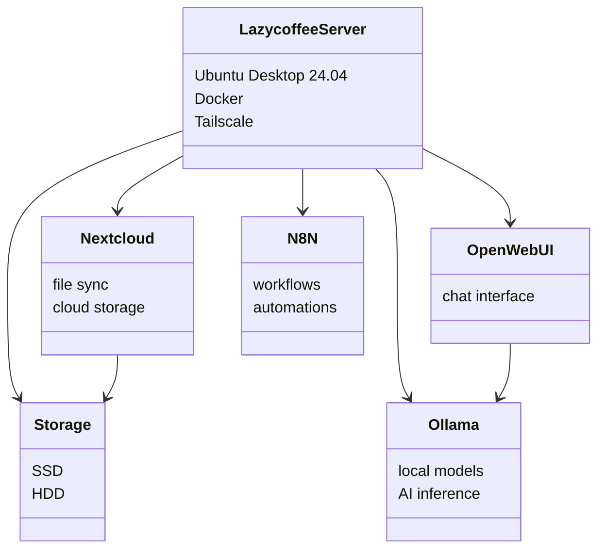

# UML Diagrams

GitHub supports Mermaid diagrams inside Markdown.

## Deployment Diagram

```mermaid
flowchart TB
    subgraph Devices
        Phone[Phone]
        Laptop[Laptop]
        Tablet[Tablet]
    end

    subgraph PrivateNetwork[Tailscale Network]
        Server[Ubuntu Desktop Server]
    end

    subgraph ServerServices[Server Services]
        Docker[Docker Engine]
        Casa[CasaOS]
        Ollama[Ollama]
    end

    subgraph Containers[Docker Containers]
        Nextcloud[Nextcloud]
        WebUI[Open WebUI]
        N8N[n8n]
        PG[PostgreSQL]
        Redis[Redis]
    end

    Phone --> PrivateNetwork
    Laptop --> PrivateNetwork
    Tablet --> PrivateNetwork
    PrivateNetwork --> Server
    Server --> Docker
    Server --> Casa
    Server --> Ollama
    Docker --> Nextcloud
    Docker --> WebUI
    Docker --> N8N
    Docker --> PG
    Docker --> Redis
```

## Service Relationship Diagram

```mermaid
classDiagram
    class LazycoffeeServer {
      Ubuntu Desktop 24.04
      Docker
      Tailscale
    }

    class Nextcloud {
      file sync
      cloud storage
    }

    class Ollama {
      local models
      AI inference
    }

    class OpenWebUI {
      chat interface
    }

    class N8N {
      workflows
      automations
    }

    class Storage {
      SSD
      HDD
    }

    LazycoffeeServer --> Nextcloud
    LazycoffeeServer --> Ollama
    LazycoffeeServer --> OpenWebUI
    LazycoffeeServer --> N8N
    LazycoffeeServer --> Storage
    OpenWebUI --> Ollama
    Nextcloud --> Storage
```
